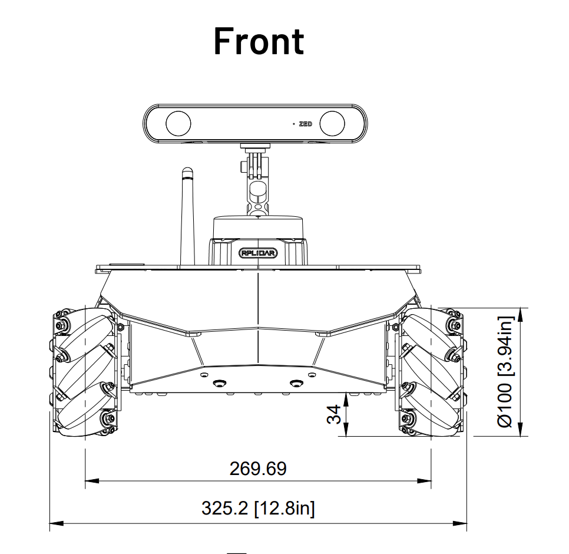
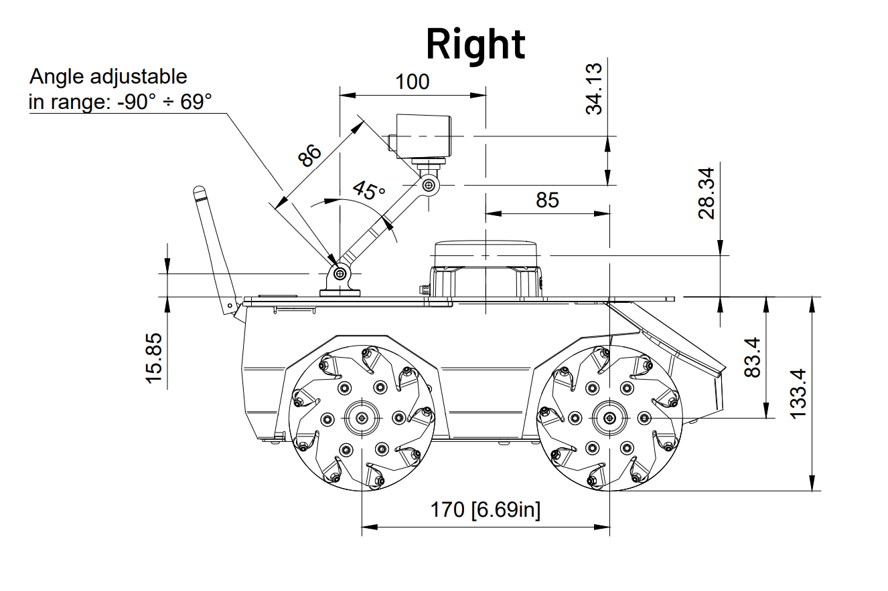
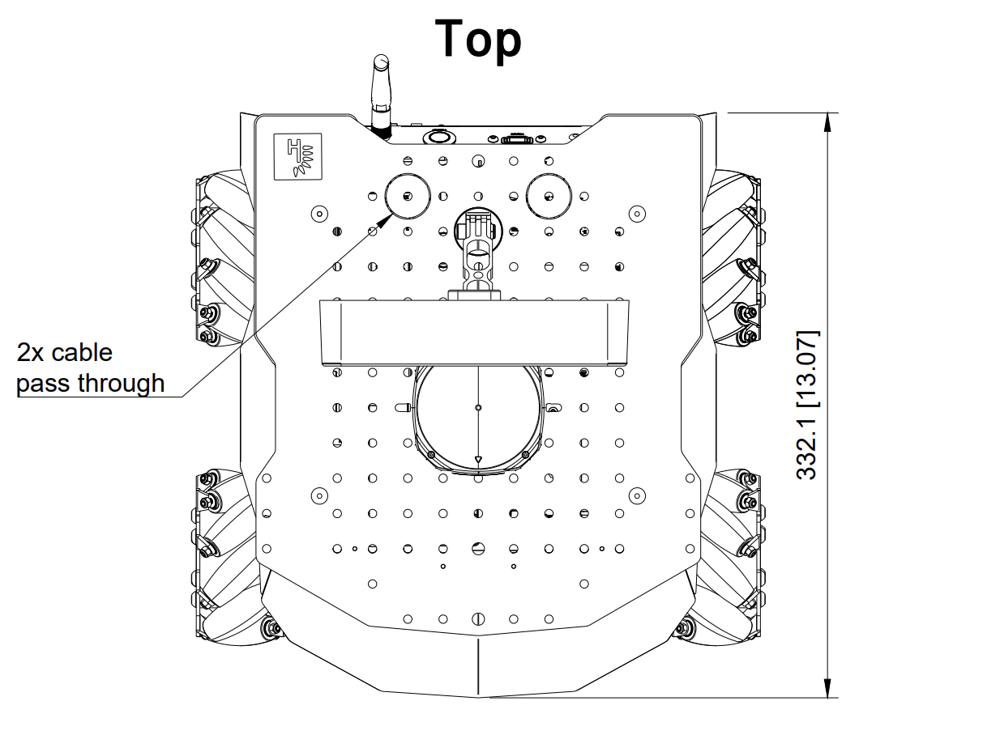
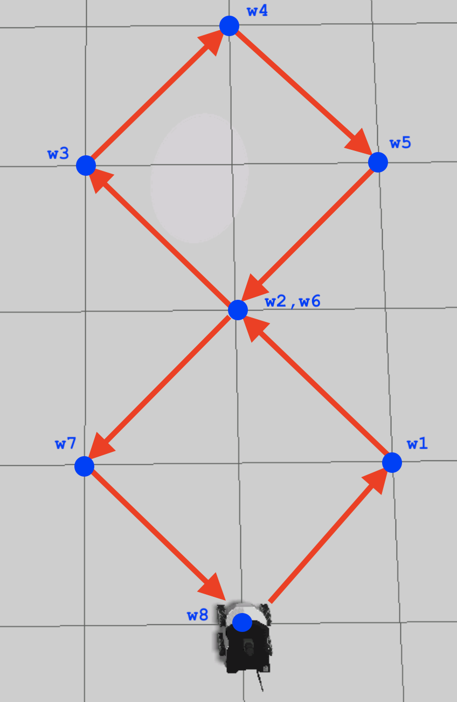

# checkpoint16

## Task 1

### Part 1
Test the robot's movements in order to classify it into one of the following groups: holonomic or non-holonomic. Once you have detected which type of robot it is, define which is the Kinematic model of the ROSBot XL.

Based on your observations create a ROS2 package named wheel_velocities_publisher with a C++ executable named also wheel_velocities_publisher. It must contain a node that publishes messages of type Float32MultiArray. Each message must contain al four wheel speeds (in rad/sec), one for each of the four robot wheels. The name of the topic should be /wheel_speed.

The messages published must execute 6 robot motions in this exact sequence order:

move forward
move backward
move sideways to the left
move sideways to the right
turn clockwise
turn counter-clockwise
After that the robot must stop. Each motion must be executed for about 3 seconds. Before each motion, print a log message to indicate the action being performed.

Run the program and confirm you get the topic publishing that data you want it to publish.

Terminal 1.
source ~/ros2_ws/install/setup.bash
ros2 run wheel_velocities_publisher wheel_velocities_publisher

Termainal 2.
source ~/ros2_ws/install/setup.bash
ros2 topic echo /wheel_speed

### Part 2

Create a new package named kinematic_model where you'll place the files for this task.
Create a C++ source file named kinematic_model.cpp, that does the following:
It subscribes to the /wheel_speed topic that is published by the node you wrote earlier in part 1.
Using the Kinematic model, it transforms the four wheel speeds into a twist message.
Finally, it publishes the twist message into the /cmd_vel topic to make the simulated robot move as intended.
Create a launch kinematic_model.launch.py file that starts the wheel_velocities_publisher node and kinematic_model node.

Terminal 1.
source ~/ros2_ws/install/setup.bash
ros2 launch rosbot_xl_gazebo simulation.launch.py

Terminal 2.
source ~/ros2_ws/install/setup.bash
ros2 launch kinematic_model kinematic_model.launch.py

## Task 2 Motion in the absolute frame

Go to ~/ros2_ws/src/checkpoint16 and create a new C++ package named eight_trajectory and a source file eight_trajectory.cpp.

This node must subscribe to the /odom topic to receive odometry information (position and orientation) of the robot and publish wheel speed commands to the /wheel_speed topic.

The program should publish wheel speed commands so that the robot follows a figure-eight path. The robot should move along each side of the path while turning, following the eight waypoints as shown in the figure:

In the above image, each of the blue points is a waypoint in the trajectory. In your program each waypoint w must be represented in the following way: [dphi,dx,dy]

Where:

dphi: represents the change in the orientation angle of the robot.

dx: represents the change in the x-coordinate of the robot's position.

dy: represents the change in the y-coordinate of the robot's position.

NOTE: They represent the DIFFERENCE, not the actual absolute coordinates. We reiterate this because it can lead to confusion.

You can use each of these three waypoint parameters as an input to a function that computes the twist (angular and linear velocities) of the robot's motion.

This is the list of all the waypoints w that make up the figure-eight path and their values for [dphi,dx,dy] respectively:
w1 = [0.0, 1, -1] 
w2 = [0.0, 1, 1] 
w3 = [0.0, 1, 1] 
w4 = [1.5708, 1, -1] 
w5 = [-3.1415, -1, -1] 
w6 = [0.0, -1, 1] 
w7 = [0.0, -1, 1] 
w8 = [0.0, -1, -1] 
Create a launch file called eight_trajectory.launch.py that starts the kinematic_model and eight_trajectory nodes.

Terminal 1.
source ~/ros2_ws/install/setup.bash
ros2 launch rosbot_xl_gazebo simulation.launch.py

Terminal 2.
source ~/ros2_ws/install/setup.bash
ros2 launch eight_trajectory eight_trajectory.launch.py

## Helper
Try to pub /cmdvel at 10Hz for 1 second
ros2 topic pub /cmd_vel geometry_msgs/msg/Twist "linear:
  x: 1.0
  y: 0.0
  z: 0.0
angular:
  x: 0.0
  y: 0.0
  z: 1.5708" --rate 10 -t 10

